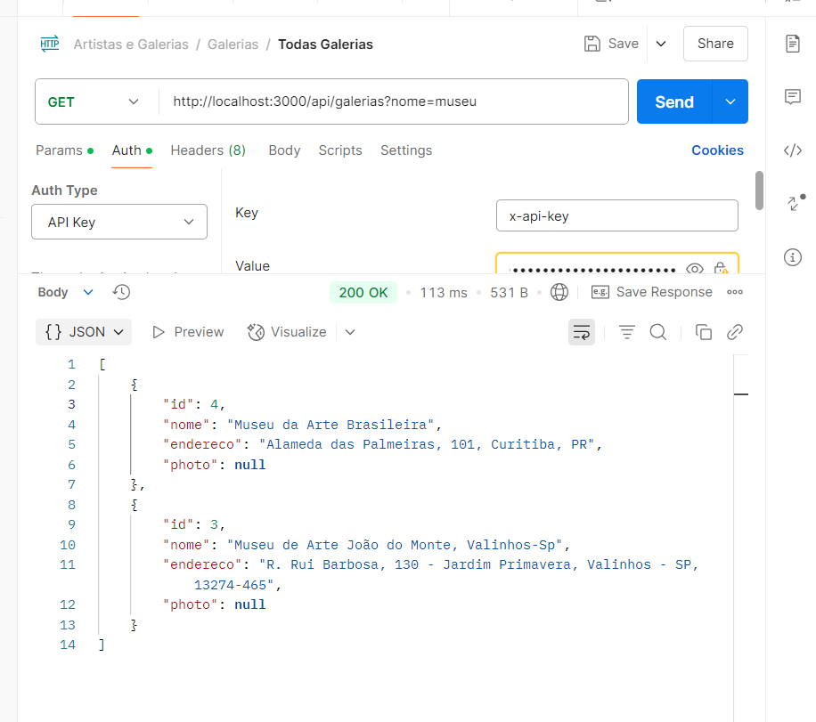

# 🎨 API de Galerias e Artistas

Este projeto tem como objetivo criar uma API para gerenciamento de **galerias de arte** e **artistas**, incluindo upload de imagens e geração de PDFs. Ideal para consultas rápidas em prova e trabalhos práticos!

---

## ✅ ESSENCIAIS

```bash
npm init -y
```
``` bash
npm install express cors dotenv pg
```
``` bash
npm install nodemon --save-dev
```
``` bash
npm install multer        # Para upload de imagem
```
``` bash
npm install pdfkit        # Para geração de PDF
```

---

## 🚀 Scripts no `package.json`

```json
"scripts": {
  "dev": "nodemon index.js",
  "start": "node index.js"
}
```

---

## 📁 Estrutura básica sugerida

```
📁 src/
├── controllers/
│   └── galeriaController.js
├── models/
│   └── galeriaModel.js
├── routes/
│   └── galeriaRoutes.js
├── uploads/
├── index.js
├── db.js
```

---

## 🌐 Pacotes instalados

| Pacote        | Função                          |
|---------------|----------------------------------|
| express       | Servidor web                    |
| cors          | Permite requisições externas    |
| dotenv        | Variáveis de ambiente           |
| pg            | Conexão com PostgreSQL          |
| multer        | Upload de imagens               |
| pdfkit        | Geração de arquivos PDF         |
| nodemon       | Atualização automática em dev   |

---

## 📝 Comandos úteis

```
# Rodar servidor em desenvolvimento
npm run dev

# Rodar servidor em produção
npm start
```

---

## 🔗 Links úteis para consulta

- 📄 [Documentação 1 - Criando uma API ](https://docs.google.com/document/d/1sWgFyhgW30Ee7-I3PVAqH4AF62iqahjo29cIVjO-dng/edit?tab=t.0)
- 📄 [Documentação 2 - Upload de Arquivos ](https://docs.google.com/document/d/1sWgFyhgW30Ee7-I3PVAqH4AF62iqahjo29cIVjO-dng/edit?tab=t.0)
- 📄 [Documentação 3 - API keyMiddleware](https://docs.google.com/document/d/1SiCyH8llsDeoI6ayJdi4dUKMgQWvg_4ODZRykw-OjAM/edit?tab=t.0)
- 📄 [Documentação 4 - Outro Repositório de Exemplo](https://github.com/souzabweatriz/Back-end-cosmeticos/blob/main/src/routes/reportRoutes.js)

---

### Filtro 

#### Model e Controller



Feito com 💻 e café ☕ para te salvar na hora da prova!
